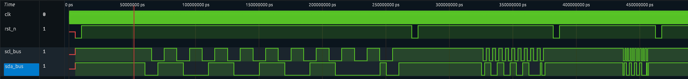
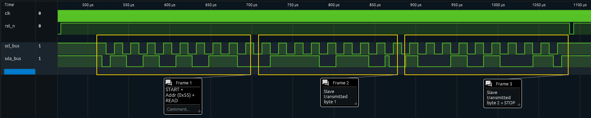
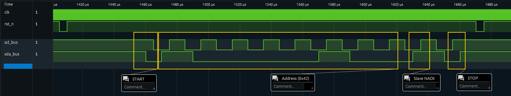
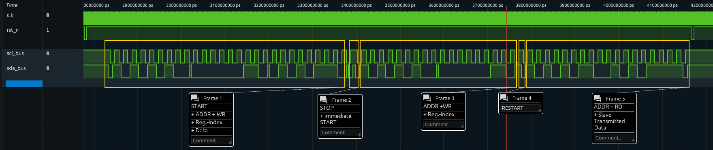

# Overarching verifications
### TC-000: Clock speed coverage
<a name="TC-000a"></a>
Every functional test in test.py is parametrized over 100 kHz, 400 kHz and 1 MHz bus speeds. The entire suite passing at all three speeds verifies correct operation across the I2C speed range.  
**Verifies:** [REQ-007](specification.md#req-007)

---

# Protocol conformance verifications
### TC-001: Write address acknowledgement and state transition
<a name="TC-001"></a>
**Test:** ```test_write_address```  
Procedure: Sends a START followed by the device address ```0x55``` with the write bit set. Confirms the address is acknowledged and the slave enters the S_RCV_PTR state. Parameterized over all I2C bus speeds.  
**Verifies:** [REQ-001](specification.md#req-001), [REQ-006](specification.md#req-006)  

**Timing diagram:**  
The following diagram shows the bus activity for testcase ```test_write_address``` repeated for all specified I2C bus speeds. In the beginning of each repetition a ```START```-condition can be seen. Following that the bus Master (from cocotb) sent the devices address of ```0x55``` with the RW-bit not set (WRITE). At the ninth positive SCL edge the slave pulls the us low ans thus acknowledging its own address. In the end a ```STOP```-condition closes the transaction.  


**Results:**  
```
**********************************************************************************************************************
** TEST                                                          STATUS  SIM TIME (ns)  REAL TIME (s)  RATIO (ns/s) **
**********************************************************************************************************************
** test.test_write_address/speed=100000.0                         PASS      265160.00           0.31     854833.64  **
** test.test_write_address/speed=400000.0                         PASS      111430.00           0.13     848122.18  **
** test.test_write_address/speed=1000000.0                        PASS       80660.00           0.10     832974.42  **
```

### TC-002: Read address acknowledgement and state transition
<a name="TC-002"></a>
**Test:** ```test_read_address```  
**Procedure:** Sends the device address with the read bit and checks for ACK, then reads two bytes back from the slave. Checks the state between bytes before terminating with a NACK. Parameterized over all I2C bus speeds.  
**Verifies:** [REQ-001](specification.md#req-001), [REQ-006](specification.md#req-006), [REQ-011](specification.md#req-011)  

**Timing diagram:**  
The following diagram shows the bus activity for testcase ```test_read_address```. Only the repitition for I2C standard mode (100 kHz) is depicted. In the beginning the I2C master (from cocotb) sends the devices address of ```0x55``` with the RW-bit set (READ). The slave ACKs its own address and starts transmitting two bytes between which the master ACKs the first byte. The transaction is ended by the master NACKing the second transmitted byte and the issuing a ```STOP```-condition.  
  

**Results:**   
```
**********************************************************************************************************************
** TEST                                                          STATUS  SIM TIME (ns)  REAL TIME (s)  RATIO (ns/s) **
**********************************************************************************************************************
** test.test_read_address/speed=100000.0                          PASS      625000.00           0.70     893221.24  **
** test.test_read_address/speed=400000.0                          PASS      201250.00           0.23     868574.02  **
** test.test_read_address/speed=1000000.0                         PASS      116500.00           0.13     862970.64  **
```

### TC-003: Foreign address rejection
<a name="TC-003"></a>
**Test:** ```test_wrong_address_no_ack```, parametrized over addresses ```0x42, 0x54, 0x56```.  
**Procedure:** Sends each foreign address and checks that the slave does not acknowledge and remains in S_IDLE. Addresses ```0x54``` and ```0x56``` differ from ```0x55``` by a single bit, exercising the full-width address comparison. Parameterized over all I2C bus speeds.  
**Verifies:** [REQ-002](specification.md#req-002)  

**Timing diagram:**   
The following diagram shows the bus activity for testcase ```test_wrong_address_no_ack```. Only the repitition for I2C standard mode (100 kHz) is depicted. In the beginning the I2C master (from cocotb) sends a wrong devices address of ```0x42``` with the RW-bit not set (WRITE). After that the slave NACKs this addres as expected. The transaction is ended by the master issuing a ```STOP```-condition.  
  

**Results:**   
```
**********************************************************************************************************************
** TEST                                                          STATUS  SIM TIME (ns)  REAL TIME (s)  RATIO (ns/s) **
**********************************************************************************************************************
** test.test_wrong_address_no_ack/wrong_addr=66/speed=100000.0    PASS      265160.00           0.30     879773.80  **
** test.test_wrong_address_no_ack/wrong_addr=66/speed=400000.0    PASS      111430.00           0.13     862504.40  **
** test.test_wrong_address_no_ack/wrong_addr=66/speed=1000000.0   PASS       80660.00           0.09     850157.59  **
** test.test_wrong_address_no_ack/wrong_addr=84/speed=100000.0    PASS      265160.00           0.30     886258.02  **
** test.test_wrong_address_no_ack/wrong_addr=84/speed=400000.0    PASS      111430.00           0.13     859024.71  **
** test.test_wrong_address_no_ack/wrong_addr=84/speed=1000000.0   PASS       80660.00           0.10     818403.75  **
** test.test_wrong_address_no_ack/wrong_addr=86/speed=100000.0    PASS      265160.00           0.30     872695.01  **
** test.test_wrong_address_no_ack/wrong_addr=86/speed=400000.0    PASS      111430.00           0.13     864996.21  **
** test.test_wrong_address_no_ack/wrong_addr=86/speed=1000000.0   PASS       80660.00           0.10     839150.02  **
```

### TC-004: Single register write  
<a name="TC-004"></a>
**Test:** ```test_full_write```   
**Procedure:** Performs a complete write transaction (address, register index ```0x03```, data ```0x57```, STOP). At RTL, a background monitor confirms exactly one reg_write pulse with the correct address and data, and the physical register is inspected. At all levels (RTL/GL), the value is read back over the bus. Parameterized over all I2C bus speeds.   
**Pass criteria:** Every byte ACKed, exactly one write pulse to the correct register (RTL). Read-back value matches written value.  
**Verifies:** [REQ-001](specification.md#req-001), [REQ-006](specification.md#req-006), [REQ-009]  (specification.md#req-009), [REQ-004](specification.md#req-004)  

**Timing diagram:**   
The following diagram shows the bus activity for testcase ```test_full_write```. Only the repitition for I2C standard mode (100 kHz) is depicted. In the beginning the I2C master (from cocotb) sends athe devices devices address of ```0x55``` with the RW-bit not set (WRITE). The master then transmits the register index pointer that indicates at what address he wants to write the next byte (in this case ```0x03```). Then this next data-byte ```0x57``` is transmitted. The transaction is ended by the master issuing a ```STOP```-condition.  
  

**Results:**   
```
**********************************************************************************************************************
** TEST                                                          STATUS  SIM TIME (ns)  REAL TIME (s)  RATIO (ns/s) **
**********************************************************************************************************************
** test.test_full_write/speed=100000.0                            PASS     1390160.00           2.33     595697.11  **
** test.test_full_write/speed=400000.0                            PASS      392690.00           0.64     615279.91  **
** test.test_full_write/speed=1000000.0                           PASS      193180.00           0.30     644766.62  **
```

### TC-005: Write-then-read roundtrip with repeated START
<a name="TC-005"></a>
**Test:** ```test_write_then_read```  
**Procedure:** Writes a value, terminates with STOP, then sets the index and reads it back using a repeated START (no STOP between index and read). Relies on the pointer being reset by the first STOP. Parameterized over all I2C bus speeds.  
**Pass criteria:** Read-back value equals the written value, proving the full data path and the repeated-START mechanism.  
**Verifies:** [REQ-005](specification.md#req-005), [REQ-009](specification.md#req-009), [REQ-011](specification.md#req-011), [REQ-004](specification.md#req-004)  

**Results:**   
```
**********************************************************************************************************************
** TEST                                                          STATUS  SIM TIME (ns)  REAL TIME (s)  RATIO (ns/s) **
**********************************************************************************************************************
** test.test_write_then_read/speed=100000.0                       PASS     1391000.00           1.64     847373.03  **
** test.test_write_then_read/speed=400000.0                       PASS      393500.00           0.44     884484.46  **
** test.test_write_then_read/speed=1000000.0                      PASS      194000.00           0.22     865983.03  **
```

---

# Register architecture
### TC-006: Bulk write with address auto-increment
<a name="TC-006"></a>
**Test:** ```test_bulk_write```  
**Procedure:** Sends one register index (```0x02```) followed by three data bytes (```0x11, 0x22, 0x33```) in a single transaction. At RTL, a background monitor confirms exactly three reg_write pulses at consecutive addresses with the correct data, and the physical registers are inspected. At all levels, each target register is read back over the bus. Parameterized over all I2C bus speeds.  
**Pass criteria:** Exactly three write pulses to consecutive addresses ```0x02–0x04``` (RTL). Each read-back value matches the corresponding written byte.  
**Verifies:** [REQ-009](specification.md#req-009), [REQ-010](specification.md#req-010)  

**Results:**   
```
**********************************************************************************************************************
** TEST                                                          STATUS  SIM TIME (ns)  REAL TIME (s)  RATIO (ns/s) **
**********************************************************************************************************************
** test.test_bulk_write/speed=100000.0                            PASS     3280160.00           5.55     591409.91  **
** test.test_bulk_write/speed=400000.0                            PASS      865190.00           1.44     602783.68  **
** test.test_bulk_write/speed=1000000.0                           PASS      382180.00           0.63     608885.40  **
```

### TC-007: Bulk read with address auto-increment
<a name="TC-007"></a>
**Test:** ```test_bulk_read```  
**Procedure:** Writes four distinct values (```0xDE, 0xAD, 0xBE, 0xEF```) to consecutive registers starting at ```0x03```, then sets the index and reads four bytes back in a single multi-byte read using a repeated START. The four values are deliberately distinct so any shift or duplication is detectable. Parameterized over all I2C bus speeds.  
**Pass criteria:** The read-back sequence exactly equals the written sequence, proving the read path auto-increments correctly across consecutive registers.  
**Verifies:** [REQ-010](specification.md#req-010), [REQ-011](specification.md#req-011)  

**Results:**  
```
**********************************************************************************************************************
** TEST                                                          STATUS  SIM TIME (ns)  REAL TIME (s)  RATIO (ns/s) **
**********************************************************************************************************************
** test.test_bulk_read/speed=100000.0                             PASS     2470000.00           2.73     903680.92  **
** test.test_bulk_read/speed=400000.0                             PASS      662500.00           0.75     887253.83  **
** test.test_bulk_read/speed=1000000.0                            PASS      301000.00           0.35     860374.16  **
```

### TC-008: Cross-block address decoding and isolation
<a name="TC-008"></a>
**Test:** ```test_address_decoding```  
**Procedure:** Snapshots all Block A registers via read-back after reset, writes a value to a Block A address (```0x02```), then attempts a write to a Block B address (```0x0B```). Verifies the Block A target received the value and that no other Block A register was disturbed by the Block B write attempt. Checks are performed both via internal inspection (RTL) and via bus read-back (all levels). Parameterized over all I2C bus speeds.  
**Pass criteria:** Block A target holds the written value. All other Block A registers remain at their post-reset values, confirming the Block B write did not leak into Block A.  
**Verifies:** [REQ-008](specification.md#req-008), [REQ-012](specification.md#req-012)  

**Results:**  
```
**********************************************************************************************************************
** TEST                                                          STATUS  SIM TIME (ns)  REAL TIME (s)  RATIO (ns/s) **
**********************************************************************************************************************
** test.test_address_decoding/speed=100000.0                      PASS    13430000.00          14.71     913238.49  **
** test.test_address_decoding/speed=400000.0                      PASS     3402500.00           3.84     885179.48  **
** test.test_address_decoding/speed=1000000.0                     PASS     1397000.00           1.60     875453.11  **
```

### TC-009: Unmapped address access
<a name="TC-009"></a>
**Test:** ```test_unmapped_address```  
**Procedure:** Writes a reference value to a real register (```0x05```), then attempts a write to an unmapped address (```0x20```) and confirms the reference register is undisturbed. Then performs a read from the unmapped address and checks the returned value. Parameterized over all I2C bus speeds.  
**Pass criteria:** The write attempt is ACKed but leaves the reference register unchanged. The read from the unmapped address returns ```0x00```.  
**Verifies:** [REQ-013](specification.md#req-013), [REQ-014](specification.md#req-014)  

**Results:**  
```
**********************************************************************************************************************
** TEST                                                          STATUS  SIM TIME (ns)  REAL TIME (s)  RATIO (ns/s) **
**********************************************************************************************************************
** test.test_unmapped_address/speed=100000.0                      PASS     2720000.00           3.01     904018.03  **
** test.test_unmapped_address/speed=400000.0                      PASS      725000.00           0.82     883392.56  **
** test.test_unmapped_address/speed=1000000.0                     PASS      326000.00           0.38     856272.01  **
```

### TC-010: Block B read-only behaviour
<a name="TC-010"></a>
**Test:** ```test_block_b_is_read_only```  
**Procedure:** Reads a Block B register (```0x0A```) as reference, attempts to write the value ```0xFF``` to it, then reads it back immediately before the LFSR can advance. Compares the read-back value against the value that was attempted to be written. Parameterized over all I2C bus speeds.  
**Pass criteria:** The write attempt is ACKed on the bus but the read-back value is not equal to ```0xFF```, proving the master cannot overwrite Block B.  
**Verifies:** [REQ-012](specification.md#req-012)  

**Results:**   
```
**********************************************************************************************************************
** TEST                                                          STATUS  SIM TIME (ns)  REAL TIME (s)  RATIO (ns/s) **
**********************************************************************************************************************
** test.test_block_b_is_read_only/speed=100000.0                  PASS     2155000.00           2.37     911126.81  **
** test.test_block_b_is_read_only/speed=400000.0                  PASS      583750.00           0.66     886988.69  **
** test.test_block_b_is_read_only/speed=1000000.0                 PASS      269500.00           0.32     855477.70  **
```

---

# LFSR (pseudo) random number generation
### TC-011: LFSR activity on Block B
<a name="TC-011"></a>
**Test:** ```test_lfsr_is_active```  
**Procedure:** Reads the same Block B register (```0x09```) four times with a 2 ms pause between reads. The pause is longer than the per-register LFSR update period (~1.3 ms), so a working LFSR will have updated the register at least once between samples. Parameterized over all I2C bus speeds.  
**Pass criteria:** At least two of the four sampled values differ, proving the LFSR is actively generating changing data.  
**Verifies:** [REQ-016](specification.md#req-016)  

**Results:**  
```
**********************************************************************************************************************
** TEST                                                          STATUS  SIM TIME (ns)  REAL TIME (s)  RATIO (ns/s) **
**********************************************************************************************************************
** test.test_lfsr_is_active/speed=100000.0                        PASS     9120000.00          10.10     903405.31  **
** test.test_lfsr_is_active/speed=400000.0                        PASS     6825000.00           7.42     920354.15  **
** test.test_lfsr_is_active/speed=1000000.0                       PASS     6366000.00           7.38     862306.63  **
```

### TC-012: All Block B registers are serviced
<a name="TC-012"></a>
**Test:** ```test_all_b_registers_updated```  
**Procedure:** Waits 5 ms (~ 4 full LFSR sweeps through Block B), then reads every Block B register and compares it against its configured reset value, which is read from the RTL ```RESET_VALUES``` parameter. Parameterized over all I2C bus speeds.    
**Pass criteria:** Every one of the eight Block B registers differs from its reset value, proving the LFSR write-address rotation reaches all registers.  

**Results:**  
```
**********************************************************************************************************************
** TEST                                                          STATUS  SIM TIME (ns)  REAL TIME (s)  RATIO (ns/s) **
**********************************************************************************************************************
** test.test_all_b_registers_updated/speed=100000.0               PASS    11180000.00          12.17     918387.02  **
** test.test_all_b_registers_updated/speed=400000.0               PASS     6590000.00           7.23     911891.52  **
** test.test_all_b_registers_updated/speed=1000000.0              PASS     5672000.00           6.21     913925.82  **
```

### TC-013: Block A is unaffected by LFSR activity
<a name="TC-013"></a>
**Test:** ```test_block_a_unaffected_by_lfsr```  
**Procedure:** Writes a distinguishable pattern (```0xA0 | index```) to all eight Block A registers in a single bulk transaction, waits 5 ms while the LFSR performs several sweeps through Block B, then reads every Block A register back. Parameterized over all I2C bus speeds.  
**Pass criteria:** Every Block A register still holds exactly its written pattern value, proving the LFSR write path never reaches Block A.  

**Results:**  
```
**********************************************************************************************************************
** TEST                                                          STATUS  SIM TIME (ns)  REAL TIME (s)  RATIO (ns/s) **
**********************************************************************************************************************
** test.test_block_a_unaffected_by_lfsr/speed=100000.0            PASS    13005000.00          14.12     921352.44  **
** test.test_block_a_unaffected_by_lfsr/speed=400000.0            PASS     7046250.00           7.73     911088.33  **
** test.test_block_a_unaffected_by_lfsr/speed=1000000.0           PASS     5854500.00           6.47     905140.49  **
```

---

# Stress tests
### TC-014: Consistency under repeated bulk reads
<a name="TC-014"></a>
**Test:** ```test_bulk_read_stress```  
**Procedure:** Performs 20 iterations of a 4-byte bulk read from Block B, with a 500 µs pause between iterations. Each iteration verifies the read completes cleanly and returns plausible values. The successful address phase of the following iteration implicitly confirms the slave returned to idle. After all iterations, per-slot variation is checked and a final read confirms continued operation. Parameterized over all I2C bus speeds.  
**Pass criteria:** All iterations complete with valid data. Each address slot shows at least two distinct values across iterations. The final sanity read succeeds.  
**Verifies:** [REQ-017](specification.md#req-017), [REQ-018](specification.md#req-018), [REQ-016](specification.md#req-016)  

**Results:**  
```
**********************************************************************************************************************
** TEST                                                          STATUS  SIM TIME (ns)  REAL TIME (s)  RATIO (ns/s) **
**********************************************************************************************************************
** test.test_bulk_read_stress/speed=100000.0                      PASS    36928200.00          40.34     915461.85  **
** test.test_bulk_read_stress/speed=400000.0                      PASS    16780050.00          18.34     914803.05  **
** test.test_bulk_read_stress/speed=1000000.0                     PASS    12750100.00          13.69     931160.54  **
```

### TC-015: Consistency under mixed read/write sequences
<a name="TC-015"></a>
**Test:** ```test_mixed_stress```  
**Procedure:** Runs 20 randomized iterations (fixed seed) of interleaved write and read transactions against a Python shadow model of Block A. Writes update the model and the register. Reads of Block A are checked against the model. After all iterations, every Block A register is read back and compared against the shadow model. Parameterized over all I2C bus speeds.  
**Pass criteria:** Every read of Block A matches the shadow model during the run, and the final read-back of all Block A registers is consistent with the cumulative effect of all writes.   
**Verifies:** [REQ-017](specification.md#req-017)  

**Results:**  
```
**********************************************************************************************************************
** TEST                                                          STATUS  SIM TIME (ns)  REAL TIME (s)  RATIO (ns/s) **
**********************************************************************************************************************
** test.test_mixed_stress/speed=100000.0                          PASS    29003200.00          31.43     922657.82  **
** test.test_mixed_stress/speed=400000.0                          PASS    10298800.00          11.20     919800.61  **
** test.test_mixed_stress/speed=1000000.0                         PASS     6557600.00           7.28     901117.65  **
```

